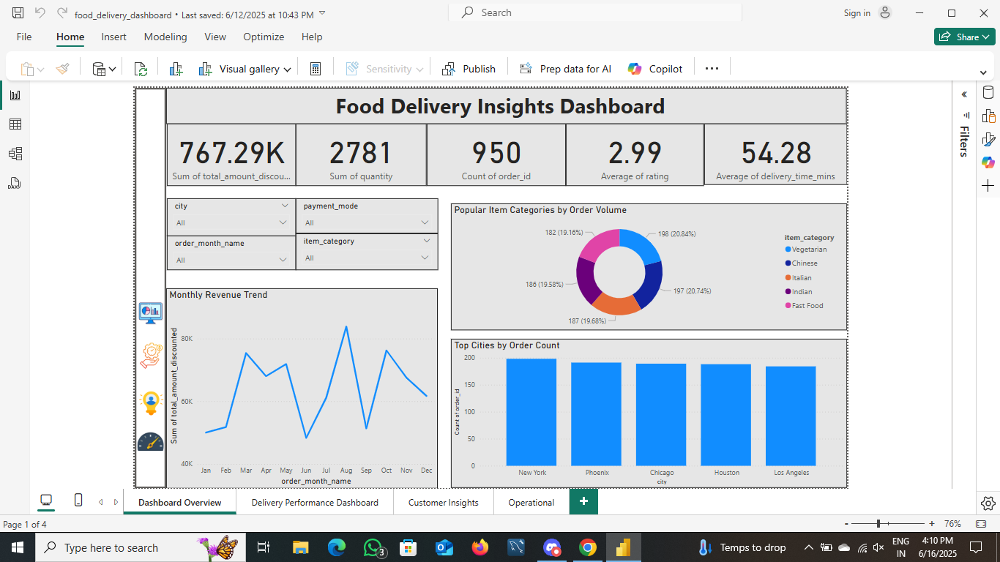
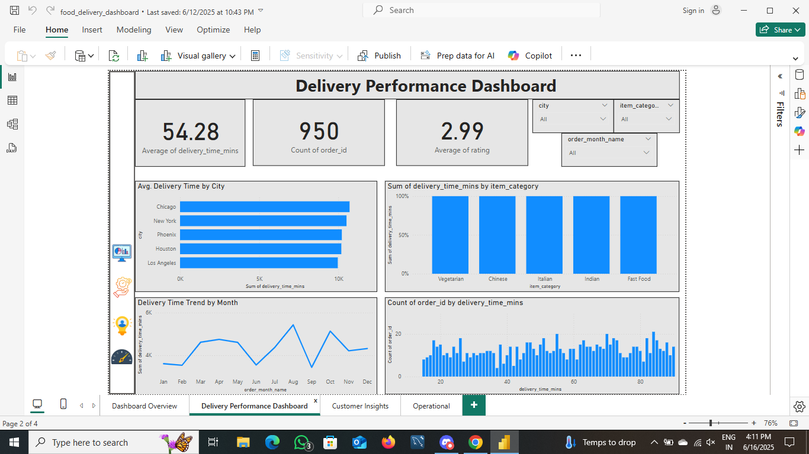
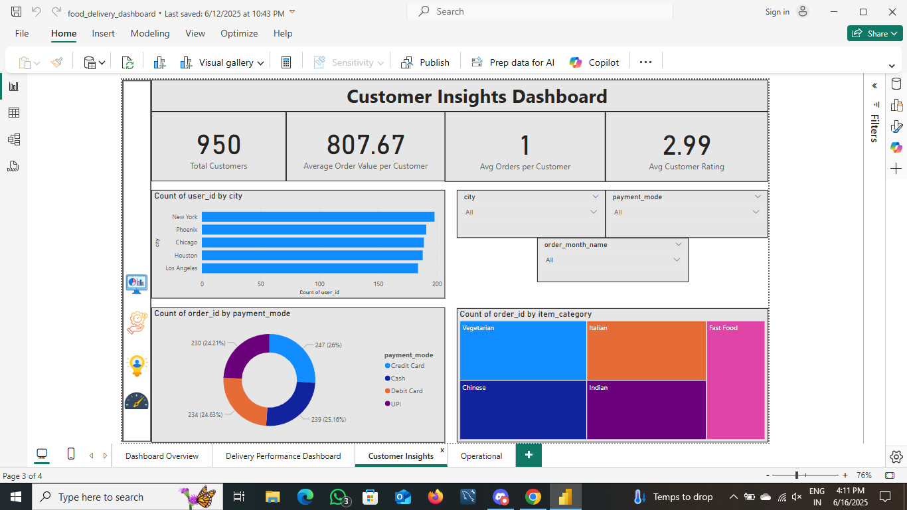
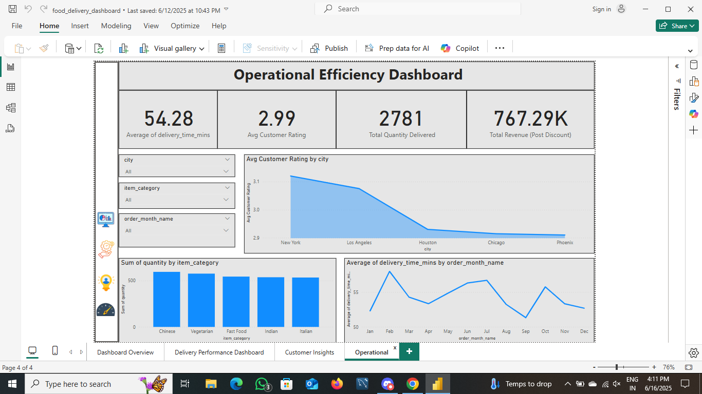

# Food Delivery Power BI Dashboard 🚚📊

This repository presents a Power BI dashboard project that provides strategic insights into a fictional food delivery business. The goal is to help stakeholders improve operational efficiency, enhance customer satisfaction, and increase revenue.

---

## 🎯 Business Objective

The dashboard was built with the perspective of a data analyst working in a food delivery company. The company wanted to answer the following key business questions:

- **How are we performing overall in terms of delivery times, revenue, and customer experience?**
- **Which cities and product categories are performing best or need attention?**
- **What patterns can we find in customer behavior, ratings, and payment methods?**
- **Where are our operational bottlenecks or opportunities for efficiency improvements?**

The dashboard helps **business heads, operations managers, and customer success teams** make **data-driven decisions**.

---

## 🧠 What We Did (Analysis Approach)

- Cleaned and transformed the raw order dataset using **Power Query**.
- Created custom measures and calculated columns using **DAX**.
- Segmented the dashboard into **four focused pages** for clear storytelling.
- Applied **dynamic slicers** to allow stakeholders to filter by city, month, or product category.
- Used a consistent **design theme** and highlighted actionable insights with visuals.

---

## 📊 Dashboard Sections

### 1. Dashboard Overview
Provides a **high-level snapshot** of overall business performance:
- Total Revenue (Post Discount)
- Average Delivery Time
- Average Customer Rating
- Number of Customers
- Monthly Revenue Trends

### 2. Delivery Performance
Helps **logistics and operations teams** analyze:
- Delivery time by city and product category
- Quantity ordered per category
- Time-based patterns in delivery delays

### 3. Customer Insights
Focuses on **user behavior and satisfaction**:
- Average ratings by category
- Customer types (New vs Returning)
- Payment mode preferences

### 4. Operational Efficiency
Highlights **internal performance bottlenecks**:
- Late deliveries by city
- Time of day and weekday delivery patterns
- Orders by platform (App vs Website)

---

## 📷 Screenshots

---

## 🔧 Tools Used
- Power BI Desktop
- Power Query (ETL)
- DAX (Data Analysis Expressions)
- Slicers, KPIs, and Conditional Formatting

---

## 👩‍💼 Author

**Divya Rathore**  
📍 Jaipur, Rajasthan  
📧 udawatdivya80@gmail.com  
🔗 [LinkedIn Profile](https://www.linkedin.com/in/divya-rathore-b95b5324b)

---

⭐ If you found this useful, feel free to fork or star the repo!
